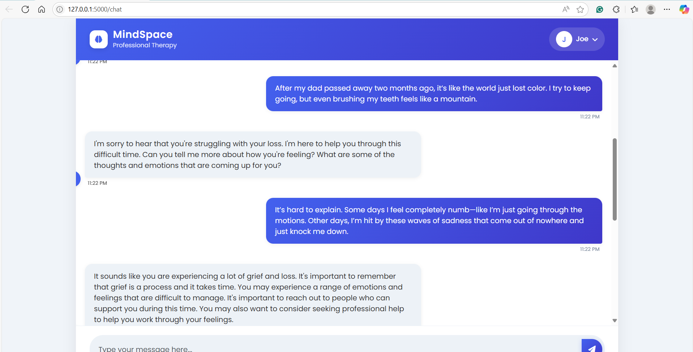

# Therapy Chat - AI-Powered Mental Health Support

Therapy Chat is a web-based application that provides AI-powered mental health support through natural conversations. The application offers a safe and private space for users to express their thoughts and feelings, with the AI providing empathetic and supportive responses.

## Features



- **User Authentication**: Secure sign-up and login system
- **AI-Powered Chat**: Intelligent conversation with context-aware responses
- **Semantic Search**: Find relevant past conversations using natural language
- **Conversation History**: View and revisit previous conversations
- **Privacy-Focused**: Secure storage of user data and conversations

> **Note**: To add images:
> 1. Create a `screenshots` directory in your project root
> 2. Add your images (e.g., `banner.png` and `chat-interface.png`)
> 3. Update the image paths in the markdown if your filenames are different

## Tech Stack

- **Backend**: Python with Flask
- **Database**: MongoDB
- **AI/ML**: 
  - Sentence Transformers for semantic search
  - Transformers for natural language processing
- **Frontend**: HTML, CSS, JavaScript
- **Authentication**: bcrypt for password hashing

## Installation

1. Clone the repository:
   ```bash
   git clone [your-repository-url]
   cd Th_chat
   ```

2. Create a virtual environment and activate it:
   ```bash
   python -m venv venv
   .\venv\Scripts\activate  # On Windows
   ```

3. Install dependencies:
   ```bash
   pip install -r requirements.txt
   ```

4. Set up environment variables:
   Create a `.env` file in the root directory with the following variables:
   ```
   SECRET_KEY=your-secret-key
   MONGODB_URI=your-mongodb-connection-string
   ```

5. Run the application:
   ```bash
   python app.py
   ```

6. Open your browser and navigate to `http://localhost:5000`

## Usage

1. **Register** a new account or **Login** if you already have one
2. Start a new conversation by typing your message in the chat interface
3. The AI will respond with supportive and empathetic messages
4. Use the search functionality to find past conversations
5. Logout when you're done

## API Endpoints

- `POST /register` - Register a new user
- `POST /login` - Authenticate user
- `POST /chat` - Send and receive messages
- `GET /semantic_search` - Search through conversation history
- `GET /logout` - End user session

## Screenshots

| Login Page | Chat Interface |
|------------|----------------|
|  |  |

## Contributing

Contributions are welcome! Please feel free to submit a Pull Request.

## License

This project is licensed under the MIT License - see the LICENSE file for details.

## Acknowledgments

- Built with Flask and modern web technologies
- Utilizes state-of-the-art NLP models for empathetic responses
- Inspired by the need for accessible mental health support

## Note

This application is not a substitute for professional medical advice, diagnosis, or treatment. Always seek the advice of your physician or other qualified health provider with any questions you may have regarding a medical condition.
